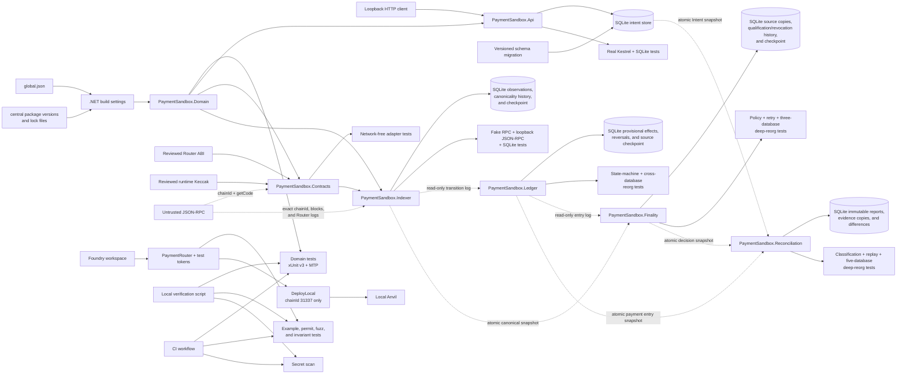
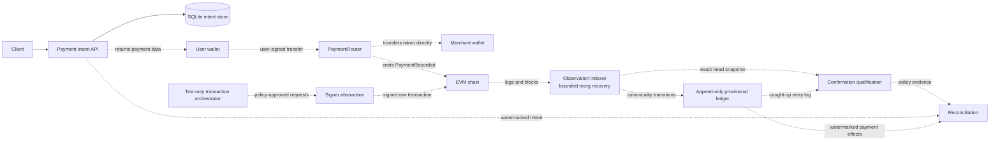

# Architecture

## Status

This document describes two different things on purpose:

1. the implementation through Week 12, including the accepted Gate A baseline; and
2. the target architecture that guides later milestones.

Dashed or explicitly labelled components are planned. They must not be read as implemented features.

## Implemented architecture through Week 12

Week 6 added the first runnable .NET application, Week 7 replaces its
volatile dictionary with a migration-owned local SQLite database. The API stays
independent from RPC and Contracts. `PaymentSandbox.Domain` remains unaware of
ASP.NET Core, SQL, and Nethereum. Week 8 adds a separate Indexer batch library
that references Domain and the reviewed Contracts event DTO. `PaymentSandbox.Contracts` still exposes only
chain-ID/code identity observations plus local unsigned calldata encoding. CI
uses isolated temporary databases and a loopback raw JSON-RPC fixture; it needs
no external RPC, database service, wallet, or credential.

Week 9 extends that library without turning it into a hosted worker. A bounded
common-ancestor search compares exact RPC headers with the locally selected
chain. SQLite retains both fork occurrences and records canonicality changes as
append-only transitions before atomically switching the checkpoint.

Week 10 adds another class library rather than a hosted worker. Ledger consumes
the Indexer's read-only transition log through an explicit high-watermark and
writes an independent SQLite database. Canonical payment occurrences append
provisional effects; later detach transitions append linked reversals.

Week 11 adds a third projection database. Finality requires an atomically read
Indexer head/transition snapshot, a Ledger checkpoint caught up to that exact
transition watermark, and the exact Ledger entry high-watermark. It appends
reversible confirmation-policy decisions without changing Ledger history.

Week 12 adds a fourth projection database. Reconciliation selects one
watermarked Intent lookup, Ledger snapshot, and Finality snapshot; copies exact
payment evidence; and appends a multidimensional report without mutating any
upstream state or creating a settlement flag.

### Build and dependency boundary

- `global.json` pins SDK `10.0.400` and selects Microsoft Testing Platform.
- `Directory.Build.props` centralizes `net10.0`, C# `14.0`, nullable analysis, warnings-as-errors, deterministic builds, and NuGet lock-file behavior.
- `Directory.Packages.props` is the only place that may choose NuGet versions.
- Each project owns its direct package references without a version attribute.
- Each `packages.lock.json` records the resolved direct and transitive graph. CI restores in locked mode and must not rewrite it.

Central package management and lock files solve different problems: the former gives reviewers one place to approve direct versions; the latter makes the complete resolved graph reproducible.

### Domain boundary

`PaymentSandbox.Domain` is intentionally dependency-light. It must not reference Nethereum, ASP.NET Core, Entity Framework, RPC clients, file systems, wallets, or cloud SDKs.

The current values are:

- `PaymentId`: a non-zero 32-byte public correlation ID with one canonical lowercase `0x` representation.
- `RawTokenAmount`: an exact integer constrained to the EVM `uint256` range.
- `EvmChainId`: a positive chain identifier constrained to `uint256` and rendered as exact decimal text.
- `EvmAddress`: a syntactically valid 20-byte address with one lowercase representation.
- `PaymentIntentTerms`: immutable chain, token, merchant, and positive raw amount facts.
- `PaymentIntent`: a process-created off-chain resource whose only current state is `Created`.

These types defend facts that every later adapter must preserve. They do not decide whether a payment is final, credited, authorized, or compliant.

### .NET contract adapter boundary

`PaymentSandbox.Contracts` is the first implemented infrastructure adapter. Its public RPC interface contains only `GetChainIdAsync` and `GetCodeAsync`; it has no account, private key, signer, send-transaction, or receipt-polling member. `PaymentRouterConnector` validates a `PaymentRouterTrustPolicy` in fail-closed order: local chain/address/hash configuration, observed chain ID, deployed code at the configured address, then Keccak-256 of those exact runtime bytes. Only a match returns `VerifiedPaymentRouterClient`.

The verified client locally encodes the reviewed `pay` and `payWithPermit` shapes from `PaymentId` and `RawTokenAmount`. Its result is destination plus calldata, not a transaction and not authorization. It also mirrors immediate Router input failures such as zero amount, malformed/zero addresses, Router-as-merchant, invalid `uint256`, and incorrectly sized signature components.

This identity check is intentionally bounded. One endpoint can lie consistently about both chain ID and code, `latest` can reorg, and code can be observed again later. Trusted-block anchoring, cross-provider comparison, finality, event indexing, and settlement remain later work.

### Payment Intent API boundary

`PaymentSandbox.Api` owns HTTP parsing, field errors, request size limits,
idempotency-key rules, response codes, and use-case orchestration. It does not
reference `PaymentSandbox.Contracts`: creating an intent neither requires nor
proves a chain connection.

The create boundary normalizes chain IDs, raw amounts, and address casing before
idempotency comparison. A SQLite `UNIQUE COLLATE BINARY` key arbitrates
concurrent writers. The store attempts an insert before reading a conflict, and
keeps both operations in one transaction, so it has no check-then-insert window.
Equal terms replay the durable original resource; different terms return a
conflict without returning that intent. The response state `created` still
describes only off-chain acceptance.

An application-owned startup migration creates `STRICT` schema and migration
tables. Unknown future versions or mismatched known migration names fail startup.
The default database survives process restart, and processes using the same
local file share its idempotency constraint. This is not cross-host horizontal
scaling, database encryption, backup, tamper evidence, or disaster recovery.
There is still no authentication, authorization, tenant boundary, rate limiting,
expiry, capacity control, or production hosting configuration.

### Chain observation boundary

`PaymentSandbox.Indexer` is an independently testable class library, not a
hosted worker. Its policy fixes one chain ID, Router address, start block, maximum
range, maximum log count, and maximum reorg depth. A caller must select an exact inclusive target;
the public RPC interface exposes chain ID, a block by number, and reviewed Router
logs for a bounded range. It contains no account, signing, broadcast, receipt
polling, balance mutation, or implicit moving-head loop.

For each batch the processor checks the RPC chain ID, reads every block header,
requires parent continuity from the existing checkpoint, and then validates each
decoded event's emitter, block number/hash, transaction hash/log index, PaymentId,
addresses, and exact positive uint256 amount. A removed, malformed, duplicate,
out-of-range, wrong-emitter, or wrong-block observation rejects the entire batch.
RPC errors retain their cause; caller cancellation is not converted into a
successful cursor advance.

The Indexer owns a separate versioned SQLite schema. `observed_blocks` permits
different hashes at one height so future fork history need not be overwritten.
`payment_recorded_observations` keys occurrences by chain, Router, block hash,
transaction hash, and log index rather than PaymentId. One transaction inserts
or verifies all source rows and advances a revisioned `(chainId, router)`
checkpoint. Same-range concurrency or a lost commit response becomes a verified
replay; a different cursor becomes a conflict.

At a new-range boundary parent mismatch, the processor searches backward no more
than the configured reorg depth. It compares the RPC and stored exact block
identities at each height. Once a common ancestor is proven, it re-reads a
complete parent-linked replacement suffix and its exact logs. A mismatch inside
that fresh suffix is treated as inconsistent RPC data and fails instead of
starting another recovery attempt.

Migration 2 adds `block_canonicality_transitions`. Normal batches append
`canonical/observed`; a reorg transaction appends `noncanonical/reorg_detached`
for the old suffix and `canonical/reorg_replacement` for the new suffix. It never
deletes old blocks or events. The current block at a height is derived from each
occurrence's latest transition. Source rows, transitions, and the revision-guarded
checkpoint switch commit together. Same-reorg concurrency or a lost response is
accepted only after the replacement rows and exact detach/attach history verify.

The Indexer checkpoint remains only a durable scan cursor, and `canonical` means this
local observer's current branch selection. It does not define confirmations,
finality, settled credit, or payout authorization. No observation changes a
Payment Intent. One endpoint may lie or omit logs, Router runtime identity is not yet
anchored at a trusted block, and the local database has no backup, encryption,
tamper evidence, retention, or cross-host coordination.

### Provisional ledger boundary

`PaymentSandbox.Ledger` references Domain and Indexer. It consumes only
`IChainObservationReader`, which exposes a committed global transition
high-watermark, one stream's ordered transitions, and payments for one exact
block occurrence. It cannot mutate source observations or the Indexer checkpoint.

The caller selects an explicit transition target. Separate transition and
payment limits bound each batch. Global transition IDs may contain gaps for a
stream; checkpointing an empty interval is safe because new append IDs cannot
later appear below the committed global high-watermark.

The Ledger owns another migration version table and SQLite file. One transaction
appends every derived entry and revision-guards its source checkpoint. A
canonical transition adds `canonical_payment`; a noncanonical transition adds
`canonical_payment_reversal` pointing to the earlier active effect for the same
exact occurrence. Re-canonicalization creates a new effect generation. Historical
entries are not updated or deleted.

A versioned SHA-256 fingerprint covers ordered source facts but excludes the
local recording time. This makes a lost-response retry verifiable even though
the two databases cannot share one transaction. Exact retries return `Replayed`;
changed source facts, stale cursors, invalid reversal order, or resource overflow
fail without advancing the ledger checkpoint.

These entries are provisional consequences of one local branch selection. They
are not confirmation/finality, token-delivery proof, balances, double-entry
accounting, reconciliation, payout authorization, or settlement. The local file
also has no backup, encryption, tamper evidence, retention, or cross-host
coordination.

### Confirmation qualification boundary

`PaymentSandbox.Finality` consumes `IChainObservationReader` and
`ILedgerEntryReader`; both are read-only. The Indexer adapter obtains one stream
head and the global canonicality high-watermark in one SQLite statement. Finality
then requires the Ledger's consumed transition cursor to equal that watermark
and the caller's selected Ledger entry target to equal the current committed
entry high-watermark. This prevents qualifying a payment while an already-known
reorg reversal waits in an unconsumed source suffix.

`ConfirmationFinalityPolicy` gives the decision a readable ID, immutable
confirmation threshold, and independent source/effect limits. For effect block
`B` and selected head `H`, confirmation count is zero when `H < B`; otherwise it
is `H - B + 1`, so the inclusion block counts as one.

The Finality database copies consumed Ledger facts, appends
`confirmation_qualified` and `confirmation_revoked` transitions, and checkpoints
both upstream snapshots plus the policy. A Ledger reversal revokes an existing
qualification with reason `ledger_effect_reversed`; a head below the threshold
uses `confirmation_threshold_lost`. Later eligibility creates a new qualification
generation. No row is updated to an irreversible final state.

One transaction copies source entries, evaluates every known effect under a hard
limit, appends decisions, and advances the checkpoint. Versioned fingerprints
and exact source/decision verification handle unknown outcomes and concurrent
same-batch writers. Schema triggers independently constrain source reversal,
active-effect qualification, threshold consistency, and revocation linkage.

Confirmation qualification remains a local, reversible policy result. It is not
protocol-native finalized/safe evidence, provider honesty, log completeness,
token delivery, a balance, payout authorization, reconciliation, or settlement.

### Reconciliation boundary

`PaymentSandbox.Reconciliation` consumes `IPaymentIntentReader`,
`ILedgerEntryReader`, and `IFinalityReader`. Each adapter returns its resource
and global append high-watermark in one SQLite statement. Reconciliation first
requires the current reads to equal the caller's explicit snapshots, then
requires Finality's Ledger entry/revision/Indexer-transition coordinates to
equal the selected Ledger checkpoint exactly.

One payment evaluation derives active effects from Ledger reversal history and
current qualification from each effect's latest selected Finality transition.
Only active effects with the Intent's chain, token, and merchant contribute to
the matching amount. Individual values remain uint256; repeated compatible
occurrences aggregate with `BigInteger` so their sum cannot overflow uint256.

The result preserves independent occurrence counts, matching and qualified
amounts, and stable discrepancy codes. Missing Intent/payment, reversed history,
chain/token/merchant mismatch, under/overpayment, and incomplete qualification
can coexist. `IsConsistent` is merely shorthand for an empty discrepancy set.

One serializable transaction appends the report, complete selected Ledger and
Finality rows, and discrepancy rows. A SHA-256 fingerprint covers policy and
complete source facts while excluding only local evaluation time. Unknown-result
and concurrent retries reread every durable field before returning `Replayed`;
changed facts at identical coordinates fail closed.

These reports explain agreement among local evidence sources. They are not
token-delivery proof, protocol finality, accounting journals, merchant balances,
payout authorization, custody, or settlement.

### Contract boundary

The Foundry workspace is a separate build system pinned to Solidity `0.8.36`, Prague EVM, OpenZeppelin Contracts `v5.7.0`, and forge-std `v1.16.1`.

The current `PaymentRouter` has no storage variables or administrator and is non-custodial on its intended payment paths. `pay` consumes an existing allowance; `payWithPermit` obtains an exact ERC-2612 allowance and pays atomically. Both paths move tokens from payer to merchant and emit `PaymentRecorded` only after `SafeERC20.safeTransferFrom` reports success. Unsolicited direct token transfers can still become stuck because the Router deliberately has no withdrawal function.

The permit owner is always `msg.sender`, the spender is always the Router, and the permit amount equals the payment amount. This deliberately excludes relayers. The permit controls allowance only; it does not sign `paymentId` or `merchant`. Because a public permit can be submitted directly to the token, an observer can consume its nonce before `payWithPermit` and make the strict combined call fail closed. This is a known denial-of-service limitation, not authority to redirect the payment.

The Router is token-agnostic and has no production token policy. An emitted amount is not sufficient evidence for fee-on-transfer, rebasing, dishonest, or otherwise unusual tokens. The future indexer must compare the Router event with the token's actual `Transfer` evidence, and production acceptance would require an explicit token policy.

## Planned payment architecture

The Router, API, SQLite intent store, bounded Indexer observation/reorg,
provisional Ledger, confirmation qualification, and reconciliation portions of
the following diagram exist. Wallet integration, protocol-native finality, and
signer paths are targets, not current implementations:

The primary payment path is non-custodial: the payer authorizes a token transfer directly to the merchant. The Router records correlation evidence but does not retain customer balances.

The later transaction orchestrator is a separate, test-only capability. It must not become an implicit production hot-wallet service merely because it can sign on Anvil or Sepolia.

## Component responsibilities

| Component                     | Owns                                                                              | Must not own                                                                 |
| ----------------------------- | --------------------------------------------------------------------------------- | ---------------------------------------------------------------------------- |
| `PaymentSandbox.Domain`       | Value objects, states, invariants, policy inputs                                  | RPC, SQL, HTTP, signing, environment configuration                           |
| `PaymentSandbox.Contracts`    | Typed ABI messages, chain/code identity checks, unsigned local calldata            | Business settlement decisions, private keys, signing or broadcasting          |
| `PaymentSandbox.Api`          | Payment intent use cases, validation, idempotent HTTP boundary                    | Chain history truth, direct key material                                     |
| `PaymentSandbox.Indexer`      | Bounded exact-range block/log observations and atomic restart checkpoints          | Settlement, finality claims, mutating chain state, overwriting fork history  |
| `PaymentSandbox.Ledger`       | Provisional occurrence effects, linked reversals, and a durable source cursor       | Finality, balances, payouts, Intent mutation, or source-history mutation     |
| `PaymentSandbox.Finality`     | Reversible confirmation qualification over exact caught-up source snapshots         | Protocol irreversibility, settlement, balances, payouts, or source mutation |
| `PaymentSandbox.Orchestrator` | Test-only transaction requests, attempts, nonce coordination, replacement history | Custody claims, arbitrary signing                                            |
| `PaymentSandbox.Reconciliation` | Explainable snapshot comparisons among Intent, Ledger, and Finality evidence    | Settlement, balances, payouts, source mutation, or claiming token delivery   |
| Solidity contracts            | Direct payer-to-merchant transfer, exact permit path, and payment event semantics | Accepted-token policy, off-chain invoices, finality, reconciliation, custody |

Dependencies point inward toward Domain. Infrastructure implements interfaces defined around use cases; Domain does not import an infrastructure SDK to make an adapter convenient.

## Invariants that shape later code

The architecture must preserve these rules as implementation grows:

1. Raw token amounts remain exact integers. Token decimals are validation and presentation metadata only.
2. `PaymentId` correlates evidence but cannot authorize a transfer or prove settlement.
3. A chain log or receipt begins as an observation, not a final business credit.
4. A canonical event occurrence has a chain-aware identity; a reorg creates a reversal, not a historical overwrite.
5. A retry with an unknown broadcast result must not create a second value transfer.
6. Signing policy validates chain, destination, selector, token, amount, and limits before a signer receives a payload.
7. Login signatures, payment intents, and permits have separate domains and replay controls.

Most of these remain roadmap invariants. The current code establishes exact
value types, a narrow non-custodial contract boundary, executable contract
failure cases, a bounded .NET identity gate, durable local business idempotency,
append-only chain observations, bounded fork recovery, provisional linked
effect/reversal history, reversible confirmation-depth qualification, and
append-only explainable reconciliation reports. It does not implement
protocol-native finality, token-delivery proof, balances, payout authorization,
or off-chain settlement.

## Trust boundaries

Current and future code must treat the following as untrusted input:

- HTTP requests and configuration values.
- RPC responses, provider availability, and unfinalized chain data.
- Contract addresses, expected code hashes, and chain IDs are untrusted configuration until syntactically validated; RPC observations remain untrusted even after they match that policy.
- Wallet signatures until domain, nonce, time, chain, and signer checks pass.
- Database state that cannot be traced to a migration and source observation.
- Any secret found in source control; committing a key makes it compromised, not merely misplaced.

CI intentionally needs no external RPC endpoint or signing secret. Week 5
identity tests use an in-memory fake, Week 7 API tests use real Kestrel listeners
and isolated temporary SQLite files, and Weeks 8-12 combine fake-RPC/fork tests
with a loopback raw JSON-RPC/ABI fixture and real temporary SQLite files. These
exercise protocol mapping, migration, restart, constraints, exact retry,
concurrent scanners/ledger writers, range/reorg/ledger limits, fork retention,
atomic branch switching, cross-database effect/reversal projection, and a
three-database deep-reorg qualification revocation, and a five-database
reconciliation history across that reorg; see [Threat
model](threat-model.md) for the active and residual controls.

## Verification boundary

The supported local verification entry point is `scripts/verify.ps1`. CI runs equivalent independent checks so a failure identifies whether the .NET build, Foundry workspace, or secret controls broke.

Direct .NET verification uses locked restore followed by build and test without a second restore. Direct Foundry verification uses format checking, build, and tests under `contracts/`.

Gate A was accepted on 2026-08-28 at commit [`cb5b5f6`](https://github.com/xiaocaiisxiaocai/dotnet-evm-payment-sandbox/commit/cb5b5f617828d14ea167fe0be4162f7d8f8f583e). Remote CI run [`33095409588`](https://github.com/xiaocaiisxiaocai/dotnet-evm-payment-sandbox/actions/runs/33095409588) passed its .NET, Foundry, and secret-scan jobs. An isolated Windows clone completed 15 .NET tests, 5 Foundry suites with 31 passing tests, a clean scan of the complete two-commit history, and a real Anvil `31337` broadcast of all three local contracts in 418.19 seconds. These results accept the repository foundation only; they do not establish production readiness. The detailed measurements and the corrected first-run CI failure are recorded in [Gate A acceptance](acceptance/gate-a.md).

## Change rules

- Add a project when a milestone has code for it; do not create empty architectural placeholders.
- Add a dependency only to the adapter that needs it, then update and review the lock file.
- Upgrade pinned tools in a dedicated change and rerun all verification.
- Record a decision when a change moves a trust boundary, introduces signing/custody, or changes an invariant.
- Keep comments focused on intent, constraints, and failure behavior. Names and tests should explain ordinary control flow.
