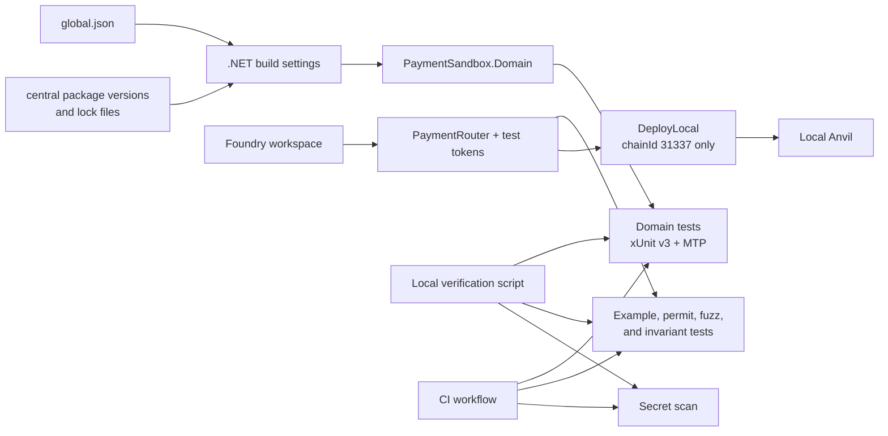
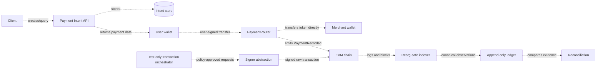

# Architecture

## Status

This document describes two different things on purpose:

1. the small architecture that exists in Week 1; and
2. the target architecture that guides later milestones.

Dashed or explicitly labelled components are planned. They must not be read as implemented features.

## Current Gate A architecture

There is no .NET runtime application in the current milestone. The Domain project does not call the contracts, and no RPC adapter connects the two build systems. Their only repository-level integration is the shared verification contract: a fresh checkout must restore, build, test, and scan without a key or RPC credential.

### Build and dependency boundary

- `global.json` pins SDK `10.0.400` and selects Microsoft Testing Platform.
- `Directory.Build.props` centralizes `net10.0`, C# `14.0`, nullable analysis, warnings-as-errors, deterministic builds, and NuGet lock-file behavior.
- `Directory.Packages.props` is the only place that may choose NuGet versions.
- Each project owns its direct package references without a version attribute.
- Each `packages.lock.json` records the resolved direct and transitive graph. CI restores in locked mode and must not rewrite it.

Central package management and lock files solve different problems: the former gives reviewers one place to approve direct versions; the latter makes the complete resolved graph reproducible.

### Domain boundary

`PaymentSandbox.Domain` is intentionally dependency-light. It must not reference Nethereum, ASP.NET Core, Entity Framework, RPC clients, file systems, wallets, or cloud SDKs.

The current values are:

- `PaymentId`: a non-zero 32-byte public correlation ID with one canonical lowercase `0x` representation.
- `RawTokenAmount`: an exact integer constrained to the EVM `uint256` range.

These types defend facts that every later adapter must preserve. They do not decide whether a payment is final, credited, authorized, or compliant.

### Contract boundary

The Foundry workspace is a separate build system pinned to Solidity `0.8.36`, Prague EVM, OpenZeppelin Contracts `v5.7.0`, and forge-std `v1.16.1`.

The current `PaymentRouter` has no storage variables or administrator and is non-custodial on its intended payment paths. `pay` consumes an existing allowance; `payWithPermit` obtains an exact ERC-2612 allowance and pays atomically. Both paths move tokens from payer to merchant and emit `PaymentRecorded` only after `SafeERC20.safeTransferFrom` reports success. Unsolicited direct token transfers can still become stuck because the Router deliberately has no withdrawal function.

The permit owner is always `msg.sender`, the spender is always the Router, and the permit amount equals the payment amount. This deliberately excludes relayers. The permit controls allowance only; it does not sign `paymentId` or `merchant`. Because a public permit can be submitted directly to the token, an observer can consume its nonce before `payWithPermit` and make the strict combined call fail closed. This is a known denial-of-service limitation, not authority to redirect the payment.

The Router is token-agnostic and has no production token policy. An emitted amount is not sufficient evidence for fee-on-transfer, rebasing, dishonest, or otherwise unusual tokens. The future indexer must compare the Router event with the token's actual `Transfer` evidence, and production acceptance would require an explicit token policy.

## Planned payment architecture

The Router portion of the following diagram exists locally. The API, persistence, wallet integration, indexer, ledger, reconciliation, and signer paths are targets, not current implementations:

The primary payment path is non-custodial: the payer authorizes a token transfer directly to the merchant. The Router records correlation evidence but does not retain customer balances.

The later transaction orchestrator is a separate, test-only capability. It must not become an implicit production hot-wallet service merely because it can sign on Anvil or Sepolia.

## Planned component responsibilities

| Component | Owns | Must not own |
| --- | --- | --- |
| `PaymentSandbox.Domain` | Value objects, states, invariants, policy inputs | RPC, SQL, HTTP, signing, environment configuration |
| `PaymentSandbox.Contracts` | Generated ABI types and narrow contract client adapters | Business settlement decisions, private keys |
| `PaymentSandbox.Api` | Payment intent use cases, validation, idempotent HTTP boundary | Chain history truth, direct key material |
| `PaymentSandbox.Indexer` | Block/log ingestion, checkpoints, canonical occurrences, reorg handling | Mutating chain state, overwriting history |
| `PaymentSandbox.Orchestrator` | Test-only transaction requests, attempts, nonce coordination, replacement history | Custody claims, arbitrary signing |
| Ledger/reconciliation | Append-only business effects, reversals, explainable differences | Treating a wallet balance as an accounting ledger |
| Solidity contracts | Direct payer-to-merchant transfer, exact permit path, and payment event semantics | Accepted-token policy, off-chain invoices, finality, reconciliation, custody |

Dependencies point inward toward Domain. Infrastructure implements interfaces defined around use cases; Domain does not import an infrastructure SDK to make an adapter convenient.

## Invariants that shape later code

The architecture must preserve these rules as implementation grows:

1. Raw token amounts remain exact integers. Token decimals are validation and presentation metadata only.
2. `PaymentId` correlates evidence but cannot authorize a transfer or prove settlement.
3. A chain log or receipt begins as an observation, not a final business credit.
4. A canonical event occurrence has a chain-aware identity; a reorg creates a reversal, not a historical overwrite.
5. A retry with an unknown broadcast result must not create a second value transfer.
6. Signing policy validates chain, destination, selector, token, amount, and limits before a signer receives a payload.
7. Login signatures, payment intents, and permits have separate domains and replay controls.

Most of these remain roadmap invariants. The current Gate A code establishes exact value types, a narrow non-custodial contract boundary, and executable contract failure cases; it does not yet implement off-chain settlement.

## Trust boundaries

Future code must treat the following as untrusted input:

- HTTP requests and configuration values.
- RPC responses, provider availability, and unfinalized chain data.
- Contract addresses, code hashes, token metadata, and chain IDs until checked.
- Wallet signatures until domain, nonce, time, chain, and signer checks pass.
- Database state that cannot be traced to a migration and source observation.
- Any secret found in source control; committing a key makes it compromised, not merely misplaced.

Week 1 CI intentionally needs no RPC endpoint or signing secret. See [Threat model](threat-model.md) for the active controls.

## Verification boundary

The supported local verification entry point is `scripts/verify.ps1`. CI runs equivalent independent checks so a failure identifies whether the .NET build, Foundry workspace, or secret controls broke.

Direct .NET verification uses locked restore followed by build and test without a second restore. Direct Foundry verification uses format checking, build, and tests under `contracts/`.

The latest local evidence on 2026-08-28 is 5 Foundry suites with 31 passed, 0 failed, and 0 skipped tests, including 256-input fuzz cases and two invariants at 64 runs by 2,048 calls. The local deployment script also broadcast successfully to Anvil and rejects any chain ID other than `31337`. Gate A remains in progress until fresh-checkout and remote CI acceptance are observed, and neither result establishes production readiness.

## Change rules

- Add a project when a milestone has code for it; do not create empty architectural placeholders.
- Add a dependency only to the adapter that needs it, then update and review the lock file.
- Upgrade pinned tools in a dedicated change and rerun all verification.
- Record a decision when a change moves a trust boundary, introduces signing/custody, or changes an invariant.
- Keep comments focused on intent, constraints, and failure behavior. Names and tests should explain ordinary control flow.
